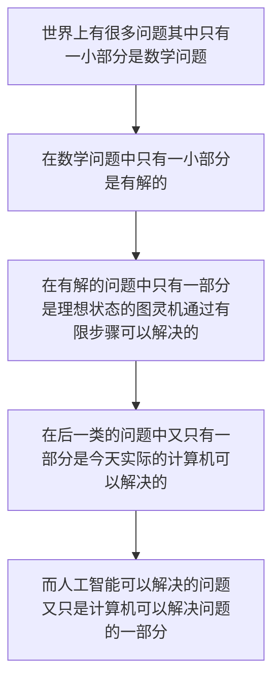

## 明确ChatGPT能解决问题的边界

> 故我们可知 我们无法让chatGPT直接预测明天地球会不会毁灭 即使人类也无法给出答案

## 基本原理

本质上就是大规模语言模型 按照概率输出结果

他的输出是基于之前训练输入的数据和过往的标记数据得到的结果

## 能做什么呢

### 选择一个主题  

我可以帮助你选择一个既有趣又与你的研究领域相关的题目。

### 制定提纲

我可以帮助你创建一个大纲，明确界定你的论文结构，包括导言、正文和结论。

### 进行研究

我可以提供进行研究的提示和资源，并寻找可靠的来源来支持你的论点。

### 撰写论文

我可以就如何写出清晰、简明、有条理的句子和段落，有效地传达你的观点提供建议。

### 修改和编辑

我可以就如何修改和编辑你的论文提供反馈，以确保它没有错误并符合学术标准。

### 引用资料

我可以指导你如何在论文中正确引用资料，包括使用MLA帮你写作这用方式。

***参考文献全是假的。***

### 代码实现

## 注意事项那个

1. 尽量用英文提问
2. 提高归纳概括的能力
3. AI知识助手
4. 谨慎乐观的使用
5. 数据有泄漏风险
